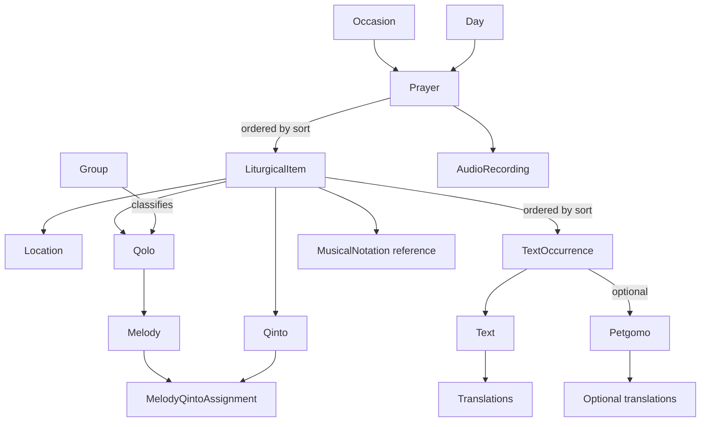

# SyriacPlatform Domain Model

**Status:** Conceptual baseline  
**Scope:** Syriac liturgical content shared by the platform and its applications  
**Purpose:** Define the domain independently of Microsoft Access, JSON, Kotlin, SQLite, user-interface design, or any other implementation detail.

---

## 1. Purpose of this document

This document describes the concepts that exist in the Syriac liturgical domain and the relationships between them.

It is not:

- a copy of the Author Database schema;
- a description of Access tables or queries;
- a JSON specification;
- a Kotlin class reference;
- a user-interface specification;
- a database migration plan.

The same domain model must remain valid if the Author Database, storage format, programming language, or application interface changes.

The intended flow is:

```text
Author Database
        ↓
Build Tools
        ↓
Application Content Packages
        ↓
Core Engine
        ↓
Applications
```

The Author Database is one source of facts. The Build Tools interpret those facts and produce application-ready content. Applications must not reproduce or depend on Access-specific tables such as `OccaExis`, `ExistsInText`, or their lookup paths.

---

## 2. Foundational principles

### 2.1 The domain is independent of storage

A concept exists because it has liturgical meaning, not because a table with the same name exists.

### 2.2 Content and occurrence are different

A reusable entity must be distinguished from one particular use of that entity.

Examples:

```text
Text ≠ TextOccurrence
Qolo ≠ LiturgicalItem
Petgomo ≠ Petgomo usage
```

This distinction prevents duplicated content and prevents occurrence-specific properties from being stored on reusable entities.

### 2.3 Text and melody are two interacting axes

Neither text nor melody alone is the center of the model.

A sung hymn is realized through their interaction:

```text
Text + Melody → sung hymn realization
```

The same text may be used with different melodies, and the same melody may be used with different texts.

### 2.4 The model must not force artificial certainty

Optional, unknown, inherited, or intentionally unclassified information must remain representable.

The model must not invent a value merely to avoid `null`, nor treat a temporary placeholder as a real liturgical concept.

### 2.5 Explicit order is authoritative

Liturgical sequence is determined by an explicit `sort` value.

It must not be inferred from:

- the order of database rows;
- the type of `Location`;
- the identifier of a `Qolo`;
- alphabetical order;
- insertion time.

### 2.6 Applications may enter the hierarchy at different levels

All applications follow the same conceptual order, but an application may start at the level appropriate to its scope.

Examples:

```text
Occasions application:
Occasion → Prayer → LiturgicalItem → content

Shhima application:
Day → Prayer → LiturgicalItem → content

Single-rite application:
Prayer or ordered LiturgicalItems → content
```

Skipping a level in the interface does not remove that level from the domain.

---

## 3. Conceptual overview



The diagram is conceptual. It does not prescribe physical tables, serialization structure, or runtime object ownership.

---

## 4. Core hierarchy

The general liturgical hierarchy is:

```text
Occasion or Day
    ↓
Prayer
    ↓
Ordered LiturgicalItems
    ↓
Ordered TextOccurrences
    ↓
Text and optional Petgomo
```

The common application navigation shape is:

```text
Occasion
    ↓
Prayer
    ↓
Location / LiturgicalItem
    ↓
Items of the hymn
```

At the final level, the user reads the ordered stanzas and may access translations, musical notation, audio, navigation back, or direct continuation to the next liturgical item.

---

## 5. Domain entities

### 5.1 Occasion

An `Occasion` represents a liturgical occasion, feast, commemoration, rite, or other occasion-based context.

An occasion may expose one or more prayers.

A default `Qinto` may apply to the occasion and be inherited by its prayers and liturgical items unless a more specific value overrides it.

An `Occasion` is not a container copied directly from an Access relationship path. It is a domain concept presented to the user and used to select relevant prayers and their ordered content.

#### Core responsibilities

- identify the liturgical occasion;
- provide its display metadata;
- expose the prayers relevant to that occasion;
- optionally provide a default `Qinto`;
- support application-specific metadata without changing the liturgical hierarchy.

### 5.2 Day

A `Day` represents a day-based entry context, especially for applications such as the Shhima.

A day may expose one or more prayers.

Conceptually, `Day` and `Occasion` are alternative higher-level entry contexts. They do not have to be forced into one artificial entity if their semantics differ.

### 5.3 Prayer

A `Prayer` represents a liturgical prayer, office, rite, or prayer-level sequence.

A prayer contains an ordered sequence of `LiturgicalItem` occurrences.

```text
Prayer
├── LiturgicalItem 1
├── LiturgicalItem 2
├── LiturgicalItem 3
└── ...
```

The sequence is determined by each item’s explicit `sort` value.

A prayer may have:

- a default `Qinto`;
- one or more recordings associated with the prayer;
- localized titles and metadata;
- application-specific presentation metadata.

A prayer-level `Qinto` applies to its liturgical items unless an item explicitly specifies another value.

### 5.4 LiturgicalItem

`LiturgicalItem` is the central occurrence entity of the prayer sequence.

It represents:

> one particular appearance of a Qolo, at a particular liturgical Location, in a particular ordered position inside a Prayer, with its applicable Qinto and ordered text occurrences.

It is not the reusable `Qolo` itself.

#### Conceptual structure

```text
LiturgicalItem
├── id
├── sort
├── location
├── qolo
├── effective or explicit qinto
├── ordered textOccurrences
├── musical notation reference?
└── presentation metadata?
```

#### Why it is required

The same `Location` may appear multiple times in one prayer.

The same `Qolo` may appear multiple times:

- with different texts;
- with different melodies;
- with different `Qinto` values;
- at different positions;
- under the same or different `Location`.

Therefore neither `Location` nor `Qolo` uniquely identifies an occurrence inside a prayer.

#### Identity

Each `LiturgicalItem` requires its own stable identifier, even when all its descriptive references match another item.

#### Ordering

`sort` is mandatory within the containing prayer.

The platform must use this order for:

- displaying the prayer sequence;
- moving to the previous item;
- moving to the next item;
- implementing the “continue” behavior that resembles turning a page in a book.

### 5.5 Location

`Location` is a controlled liturgical descriptor for the type or place of an item inside a prayer.

Examples include:

```text
ܡܰܙܡܽܘܪܳܐ
ܡܥܺܝܪܳܢܳܐ
ܥܶܩܒܳܐ
ܟܽܘܪܳܟܳܐ
ܥܶܢܝܳܢܳܐ
ܩܳܢܽܘܢܳܐ ܝܰܘܢܳܝܳܐ
ܩܳܠܳܐ
ܩܳܠܳܐ ܕܒܳܬܰܪ ܣܶܕܪܳܐ
ܩܳܠܳܐ ܕܦܺܝܪܡܳܐ
ܩܳܠܳܐ ܕܒܳܬܰܪ ܦܺܝܪܡܳܐ
ܩܽܘܩܠܺܝܽܘܢ
ܩܳܠܳܐ ܕܪܰܡܫܳܐ
ܩܳܠܳܐ ܕܨܰܦܪܳܐ
ܒܳܥܽܘܬܳܐ
ܙܽܘܡܳܪܳܐ
ܗܽܘܠܳܠܳܐ
ܩܰܕܺܝܫ ܐܰܢ̄ܬ ܐܰܠܳܗܳܐ
ܡܰܕܪܳܫܳܐ
ܬܰܟܫܶܦܬܳܐ
```

A `Location` may be an apparent hymn type or prayer section, but the platform must treat it strictly as the controlled liturgical descriptor selected from the accepted list. It must not be confused with `Group`.

#### Important rules

- A `Location` is reusable.
- The same `Location` may occur multiple times in one prayer.
- A `Location` is not a unique position.
- A `Location` does not determine ordering.
- A temporary “unknown” emoji or placeholder from the Author Database is not a valid domain value.
- Unknown or unresolved location data must be represented explicitly as missing or unresolved, not as a false liturgical category.

### 5.6 Qolo

A `Qolo` is the stable named identity of a hymn in the tradition.

Philosophically, it is comparable to the title of a sung poem or song: its complete reality depends on the conjunction of text and melody. If either axis disappears, the sung Qolo is no longer fully realized.

The stored `Qolo` entity provides a reusable identity and title. Its concrete liturgical realization occurs through a `LiturgicalItem`, which supplies:

- a particular prayer context;
- a `Location`;
- a resolved or applicable `Qinto`;
- ordered text occurrences;
- the media required by the application.

#### Important rules

- A Qolo is not merely a container of texts.
- A Qolo is not merely a melody.
- A Qolo is not a prayer position.
- A Qolo may appear more than once in one prayer.
- Different occurrences of the same Qolo may use different texts or melodies.
- A complete sung realization requires at least one stanza and an applicable melody.

### 5.7 Group

A `Group` classifies Qolos.

It is not part of the liturgical containment hierarchy.

```text
Group ── classifies ──> Qolo
```

A group must not be used to infer:

- prayer order;
- Location;
- occasion membership;
- ownership of texts;
- containment of liturgical items.

Its purpose is classification, browsing, authoring support, and other non-hierarchical organization.

### 5.8 Text

A `Text` is one stanza.

```text
Text = one stanza
```

It is the smallest ordinary textual unit in the model.

A Qolo realization must contain at least one stanza, represented through one or more ordered `TextOccurrence` entities.

#### Conceptual structure

```text
Text
├── Syriac text
├── Arabic translation?
├── other translations?
└── reusable identity
```

#### Important rules

- A Text is reusable.
- A Text does not contain its liturgical order.
- A Text does not own a Petgomo.
- A Text does not know every prayer or Qolo occurrence in which it is used.
- Translations belong to the Text itself because they translate that stanza.

### 5.9 TextOccurrence

A `TextOccurrence` represents one use of a `Text` inside one `LiturgicalItem`.

It is required because occurrence-specific properties do not belong to the reusable stanza.

#### Conceptual structure

```text
TextOccurrence
├── id
├── sort
├── text
└── petgomo?
```

#### Important rules

- `sort` determines stanza order inside the LiturgicalItem.
- The same Text may have multiple occurrences.
- The same Text may occur with a Petgomo in one place and without it in another.
- The same Text may occur with different Petgomo references in different places.
- A TextOccurrence belongs to exactly one LiturgicalItem.
- A TextOccurrence references exactly one Text.
- A TextOccurrence references zero or one Petgomo.

### 5.10 Petgomo

A `Petgomo` is a special kind of reusable liturgical text.

It is stored as an independent entity because its function differs from that of an ordinary stanza.

When assigned to a `TextOccurrence`, its fixed display position is immediately before the stanza:

```text
Petgomo
Text
```

Not every stanza occurrence has a Petgomo.

#### Reuse

The same Petgomo may be used hundreds of times without duplication.

For example, a doxological Petgomo may precede the third stanza in many hymns, while remaining one reusable entity referenced by identifier.

#### Conceptual structure

```text
Petgomo
├── Syriac text
├── Arabic translation?
├── other translations?
└── reusable identity
```

Petgomo translations are conceptually supported even when the current Author Database does not yet provide them.

#### Important rules

- A Petgomo is not embedded permanently inside Text.
- A Petgomo belongs to a TextOccurrence assignment, not to Text.
- A Petgomo is optional.
- When present, it is displayed immediately before the associated stanza.
- The model must not require translations that do not yet exist.

### 5.11 Translation

A `Translation` is localized text associated with a translatable textual entity.

For the current domain, translations may belong to:

- `Text`;
- `Petgomo`.

A translation must identify its language.

Conceptually:

```text
Translation
├── language
├── value
└── optional metadata
```

The absence of a translation is valid and must not prevent display of the Syriac source text.

### 5.12 Qinto

A `Qinto` is the liturgical tonal or modal selection used to determine the appropriate melody within the applicable hymn context.

Applications performing the liturgy primarily deal with `Qinto`, not with human mnemonic melody names.

#### Inheritance

A Qinto may be specified at different levels:

```text
Occasion default
        ↓
Prayer override
        ↓
LiturgicalItem override
```

The most specific explicit value takes precedence.

Conceptual resolution:

```text
effectiveQinto =
    LiturgicalItem.qinto
    otherwise Prayer.qinto
    otherwise Occasion.qinto
    otherwise unresolved
```

The Build Tools may resolve this before packaging, or the Core Engine may resolve it according to the package contract. Applications must not guess.

#### Special case: one available melody

If a Qolo has only one applicable melody, that melody is used wherever the Qolo appears, even when a separate Qinto classification is unnecessary for choosing between alternatives.

#### Future calculation

Some date-dependent feasts may require a computed Qinto based on the year and calendar rules. This is a future domain service and does not change the current conceptual model.

### 5.13 Melody

A `Melody` represents a distinct recognizable melody associated with a Qolo.

Its name is often mnemonic: human memory more easily recognizes a melody through words associated with it than through an abstract number.

For example, a person may recognize:

```text
Qolo name + memorable words
```

more reliably than:

```text
Qinto 6, melody 1
```

#### Liturgical applications

In current prayer-oriented applications:

- the application imposes the correct liturgical result;
- the user does not normally choose a melody;
- prayer recordings are already tied to the prayer;
- the appropriate musical notation can be selected in advance.

#### Beth Gazo application

A future Beth Gazo application will treat Melody as a primary learning and browsing concept. It must eventually distinguish at least two different forms of plurality:

##### Alternative melodies

Several valid melodies are available, often through borrowing or exchange among neighboring Syriac traditions. A user may choose among them.

##### Sequential melodies — ܡܫܚܠܦܐ

Several melodies are not alternatives but must be used one after another in sequence, as commonly occurs in some supplications.

These future behaviors must not be reduced to one ambiguous “multiple melodies” flag.

### 5.14 MelodyQintoAssignment

`MelodyQintoAssignment` represents the many-to-many relationship between `Melody` and `Qinto`.

```text
Melody * ── MelodyQintoAssignment ── * Qinto
```

A melody may be associated with more than one Qinto, and a Qinto may contain more than one melody.

#### Optional role

The relationship may optionally carry a role:

```text
PRIMARY
SUBSTITUTE
null
```

`null` means that the relationship is intentionally unclassified or not yet known. The model must not force an invented role.

This assignment alone does not always select one unique melody, because one Qinto may contain several melodies for the same Qolo.

For current prayer applications, final media and presentation choices may be pre-resolved by the Build Tools.

### 5.15 AudioRecording

`AudioRecording` represents reusable audio media.

For the current application scope, recordings are associated primarily with prayers:

```text
Prayer
└── AudioRecording
```

A prayer may have one or more recordings, depending on language, performer, edition, quality, or future media requirements.

The current model must not assume that each stanza or each LiturgicalItem necessarily has an independent recording.

Future applications may introduce more precise recording scopes without invalidating the existing concept.

### 5.16 MusicalNotation

`MusicalNotation` represents a musical score or notation resource.

The notation appropriate to a liturgical occurrence can be selected explicitly during content preparation.

The domain must allow notation to be related to the musical identity required for the item, without requiring the user to resolve ambiguous melodies during ordinary prayer use.

The exact storage form—image, PDF page, structured notation, or other asset—is outside this document.

---

## 6. Cardinalities and relationships

The following cardinalities express the current conceptual model.

```text
Occasion 1 ───── 0..* Prayer
Day      1 ───── 0..* Prayer

Prayer 1 ───── 1..* LiturgicalItem
LiturgicalItem 1 ───── 1 Location
LiturgicalItem 1 ───── 1 Qolo
LiturgicalItem 1 ───── 0..1 explicit Qinto
LiturgicalItem 1 ───── 1..* TextOccurrence

TextOccurrence 1 ───── 1 Text
TextOccurrence 1 ───── 0..1 Petgomo

Text 1 ───── 0..* Translation
Petgomo 1 ───── 0..* Translation

Group 1 ───── 0..* Qolo
Qolo 1 ───── 1..* Melody
Melody * ───── * Qinto
MelodyQintoAssignment resolves the many-to-many relationship

Prayer 1 ───── 0..* AudioRecording
LiturgicalItem 1 ───── 0..* MusicalNotation reference
```

A physical implementation may normalize or embed these relationships differently, but it must preserve their meaning.

---

## 7. Ordering rules

### 7.1 LiturgicalItem order

Every LiturgicalItem has an explicit `sort` value within its Prayer.

The pair below must be unique within one Prayer:

```text
(prayerId, sort)
```

If equal sort values are temporarily allowed during authoring, the Build Tools must detect and resolve or reject the ambiguity before producing an application package.

### 7.2 TextOccurrence order

Every TextOccurrence has an explicit `sort` value within its LiturgicalItem.

The pair below must be unique within one LiturgicalItem:

```text
(liturgicalItemId, sort)
```

### 7.3 Navigation

Previous and next navigation is derived from the sorted LiturgicalItem sequence.

The “continue” action moves to the next LiturgicalItem directly, without forcing the user to return to the list.

At the final item, the application may:

- disable continuation;
- return to the prayer summary;
- move according to an application-specific higher-level sequence.

The domain supplies the order; the application chooses the final interaction.

---

## 8. Qinto and melody resolution

Qinto and melody resolution must be deterministic for prayer-oriented applications.

### 8.1 Qinto precedence

```text
LiturgicalItem explicit Qinto
        overrides
Prayer Qinto
        overrides
Occasion Qinto
```

A missing value is not equivalent to an arbitrary default.

### 8.2 Melody ambiguity

A Qinto may correspond to more than one Melody for the same Qolo.

Therefore this rule is not universally valid:

```text
Qolo + Qinto → exactly one Melody
```

The model must preserve the possibility of:

- alternative melodies;
- sequential melodies;
- an explicitly preselected melody or notation;
- a single available melody;
- a future Beth Gazo selection workflow.

### 8.3 Current application strategy

For the current prayer-oriented applications:

- audio is selected at prayer level;
- musical notation may be preselected;
- the application presents the intended liturgical result;
- the user is not required to resolve melody ambiguity.

The Build Tools may flatten complex source relationships into explicit application-ready references.

---

## 9. Application content model

The application package should follow the domain hierarchy rather than the Author Database schema.

A conceptual package shape is:

```text
ApplicationContent
├── metadata
├── occasions?
├── days?
├── prayers
├── locations
├── qolos
├── qintos
├── texts
├── petgomé
├── translations
├── media
└── indexes or lookup structures
```

A conceptual navigation projection is:

```text
Occasion or Day
    ↓
Prayer
    ↓
ordered LiturgicalItems
    ↓
ordered TextOccurrences
```

The physical package may use normalized references, embedded read models, or both.

### 9.1 Read-optimized packaging

Applications should receive content that is ready to read.

They must not reconstruct the Author Database lookup path:

```text
Occasion
→ OccaExis
→ ExistsIn
→ ExistsInText
→ Text
```

That path belongs to source interpretation and Build Tools, not to runtime application logic.

### 9.2 Different entry points

An application package may define its entry point.

Examples:

```text
Occasions App:
entry = Occasion list

Shhima App:
entry = Day list

Tahra / single rite:
entry = one Prayer or its ordered LiturgicalItems
```

The lower-level domain remains shared.

---

## 10. Conceptual example

```text
Occasion: Nativity
└── Prayer: Evening Prayer
    ├── LiturgicalItem sort 10
    │   ├── Location: ܟܽܘܪܳܟܳܐ
    │   ├── Qolo: ܡܰܪܝܰܡ ܝܳܠܕܰܬ ܐܰܠܳܗܳܐ
    │   ├── Qinto: inherited or explicit
    │   └── TextOccurrences
    │       ├── sort 10 → Text A
    │       ├── sort 20 → Text B
    │       └── sort 30 → Petgomo X + Text C
    │
    ├── LiturgicalItem sort 20
    │   ├── Location: ܥܶܢܝܳܢܳܐ
    │   ├── Qolo: first response hymn
    │   └── TextOccurrences ...
    │
    ├── LiturgicalItem sort 30
    │   ├── Location: ܥܶܢܝܳܢܳܐ
    │   ├── Qolo: second response hymn
    │   └── TextOccurrences ...
    │
    └── LiturgicalItem sort 40
        ├── Location: ܩܳܠܳܐ
        ├── Qolo: ܩܽܘܩܳܝܳܐ
        ├── Qinto: 6
        └── TextOccurrences ...
```

This example demonstrates that:

- the same Location may repeat;
- order comes from `sort`;
- each occurrence has its own identity;
- a Petgomo belongs to one TextOccurrence;
- the same Qolo may appear again elsewhere with another Qinto or text sequence.

---

## 11. Domain invariants

The following invariants must be enforced by authoring validation, Build Tools, the Core Engine, or a suitable combination.

### 11.1 Prayer invariants

- A Prayer contains at least one LiturgicalItem when published.
- Every published LiturgicalItem has a valid explicit order.
- LiturgicalItem order is deterministic.

### 11.2 LiturgicalItem invariants

- Every LiturgicalItem belongs to one Prayer.
- Every LiturgicalItem references one Location.
- Every LiturgicalItem references one Qolo.
- Every LiturgicalItem contains at least one TextOccurrence.
- An unresolved Qinto is allowed only when the application can still determine the correct result, such as a Qolo with one applicable melody, or when the package intentionally marks the value unresolved for a non-performing workflow.

### 11.3 TextOccurrence invariants

- Every TextOccurrence belongs to one LiturgicalItem.
- Every TextOccurrence references exactly one Text.
- Every TextOccurrence has a deterministic order.
- A TextOccurrence may reference at most one Petgomo.
- A Petgomo, when present, is rendered immediately before its Text.

### 11.4 Text and translation invariants

- A Text represents exactly one stanza.
- Syriac source content is required for a published Text.
- Translations are optional.
- Missing translations must not block publication of the Syriac text.

### 11.5 Classification invariants

- Group classification must not alter liturgical hierarchy.
- Location must come from the controlled domain list or be explicitly unresolved.
- Temporary source placeholders must not become published domain categories.

### 11.6 Media invariants

- A missing recording or notation must not invalidate textual content unless a specific application declares that media mandatory.
- Media references must identify valid packaged assets.
- The application must not present a user choice when the liturgical result has already been explicitly prescribed.

---

## 12. Author Database mapping boundary

The existing Author Database contains tables such as:

```text
Texts
Petgomo
MusicNotes
RofMP3
ExistsIn
ExistsInText
OccaExis
TextMelody
```

These names help explain available facts, but they do not define the platform domain.

### 12.1 Source interpretation

Examples of source meaning:

- `ExistsIn` describes a reusable structural placement.
- `OccaExis` connects an Occasion to such a placement.
- `ExistsInText` assigns Text records to that placement.
- `TextMelody`, despite its name, has been used as an authoring convenience to connect Texts and Qolos.
- Some information represented by `TextMelody` may be derivable from other relationships.

### 12.2 Build Tools responsibility

Build Tools must:

- read source relationships;
- interpret their meaning;
- validate required facts;
- resolve ordering;
- resolve inheritance where appropriate;
- remove temporary placeholders;
- produce stable identifiers;
- emit application-ready content.

### 12.3 Runtime prohibition

Runtime applications must not depend on:

- Access table names;
- Access query order;
- Access relationship traversal;
- authoring-only convenience tables;
- placeholder values used to avoid database nulls.

---

## 13. Application behavior supported by the model

The model supports:

- browsing occasions or days;
- selecting prayers;
- viewing ordered liturgical items;
- repeated use of the same Location;
- repeated use of the same Qolo;
- deterministic next and previous navigation;
- displaying ordered stanzas;
- displaying an optional Petgomo immediately before a stanza;
- showing per-stanza translations;
- future Petgomo translations;
- prayer-level audio playback;
- musical notation display;
- application-specific entry points;
- future Qinto calculation;
- future Beth Gazo melody learning and comparison.

---

## 14. Explicit non-goals of the current model

The current baseline does not yet fully define:

- the complete Beth Gazo user experience;
- user choice among alternative melodies;
- sequential melody execution for ܡܫܚܠܦܐ;
- the mathematical calculation of date-dependent Qinto;
- the exact asset file format for notation;
- the exact audio edition and performer metadata model;
- the final JSON schema;
- Kotlin data classes;
- database persistence strategy;
- UI components or screen layouts.

These are future design layers built on this domain baseline.

---

## 15. Recommended domain vocabulary

| Concept | Recommended English name | Meaning |
|---|---|---|
| المناسبة | `Occasion` | Occasion-based entry context |
| اليوم | `Day` | Day-based entry context |
| الصلاة / الرتبة | `Prayer` | Ordered prayer-level sequence |
| ظهور الترتيلة داخل الصلاة | `LiturgicalItem` | One ordered Qolo occurrence in a Prayer |
| الموضع الليتورجي | `Location` | Controlled liturgical descriptor |
| القولو | `Qolo` | Stable named hymn identity |
| المجموعة | `Group` | Non-hierarchical Qolo classification |
| البيت | `Text` | One stanza |
| استعمال البيت | `TextOccurrence` | One ordered use of a stanza |
| الفتغام | `Petgomo` | Reusable special text placed before a stanza occurrence |
| القينة | `Qinto` | Liturgical tonal/modal selection |
| اللحن المسمّى | `Melody` | Distinct mnemonic melody identity |
| علاقة اللحن بالقينة | `MelodyQintoAssignment` | Many-to-many assignment with optional role |
| التسجيل | `AudioRecording` | Audio media, currently prayer-oriented |
| النوتة | `MusicalNotation` | Musical notation resource |
| الترجمة | `Translation` | Language-specific translation of Text or Petgomo |

---

## 16. Final conceptual statement

The SyriacPlatform domain is not centered on one table or one entity.

It models a liturgical sequence in which reusable concepts are brought together through ordered occurrences:

```text
Context
    → Prayer
        → LiturgicalItem
            → Location
            → Qolo
            → Qinto
            → ordered TextOccurrences
                → optional Petgomo
                → Text
                    → Translations
```

The platform must preserve both:

1. the reusable identities of texts, Petgomé, Qolos, melodies, Qintos, Locations, and classifications; and  
2. the exact ordered way in which those identities are used in a particular prayer.

That distinction is the foundation on which Build Tools, content packages, the Core Engine, and all future applications must be built.
